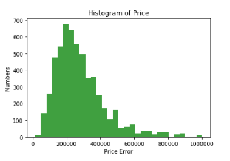
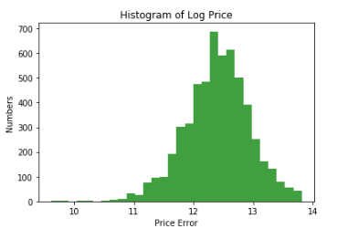
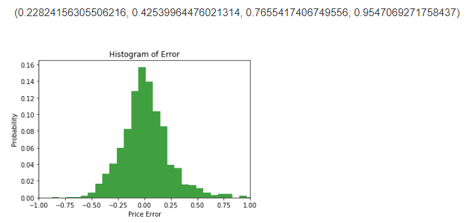
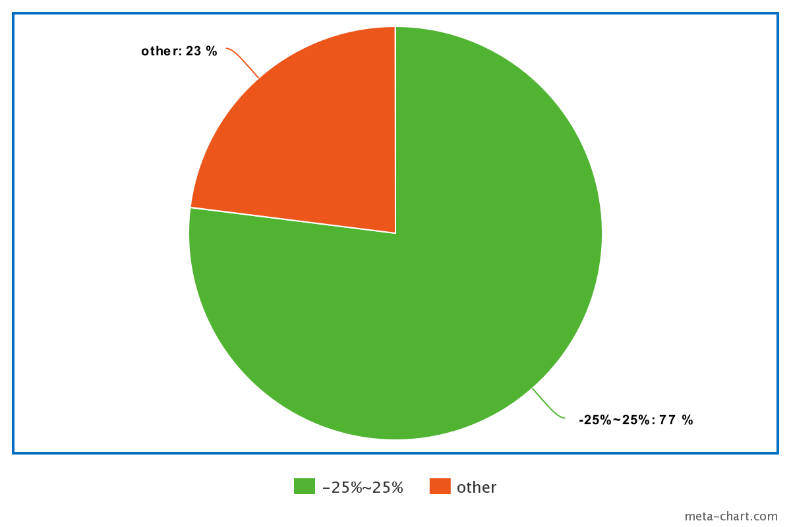
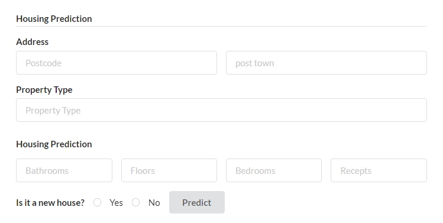

# Real-estate Project

---

## Requement:

- build a simple engine that helps home owners assess the value of their property. The engine will use a machine learning algorithm to determine the final figure.

- To be more specific, you want to build this pilot phase for homeowners in the county of *Somerset, United Kingdom*.

## Plan

---

1. Get the dataset(day01).
2. Understanding the data(day01).
3. Clean the data(data preporcessing, day02).
4. Train and test your data(day03).
5. Interface(day04).
6. What else I can do(day05):
    - Data visualization.
    - nlp?
    - computer version?

## Dataset

---
- [gov.uk](https://www.gov.uk/government/statistical-data-sets/price-paid-data-downloads)

Do not have enhough information.

- [Zoopla](https://developer.zoopla.co.uk/)

Advantage :

It is a good api for our project which contains address, rooms and price. Also, it is easy to set the time and place we want by api. It is really convenient. Realistic : Zoopla is a British company, focuses on providing users with access to information such as sold house prices, area trends & statistics and current value estimates for domestic properties in the UK (Reference from Wiki). And this api is provided by them.

Disadvantage : 

1. Cannot get the history data. We can only get the house sold or saling in this year (Totally 5,700).
2. No size of the house.


Details about this api:

- country : The country of the house
- county : The county(somerset)
- street
- post_town
- out_code : With the street name, post town and out_code we can find the house.
- dersription : Dersrip how is the house looks like.
- details of rooms : How many bedroom, floors, recepts, bathroom
- latitude
- longitude : With the latitude and longitude we can findout the spercific loc of the house.
- new_home : Is it new?
- price : The price of the house.
- image_urls : By using this url you can find the picture of the house.

- url = http://api.zoopla.co.uk/api/v1

    1. page_size: Set the number of result we want to git in one time (max 100, min 10).

    2. page_number: Iterating the dataset page by page. Totally 58 pages with 5,769 pices of data.

    3. area: Set the area of house returned by this api (Somerset).

## Data Preporcessing

---

- Pick out the useful information

    latitude, longitude, property_type, num_bathrooms, num_bedrooms, num_floors, num_recepts, postcode, post_town, new_home, price

- Denoise

    1. Delete the house with 0 price.

    2. Delet the house which price more than 1.5 million.

- Bayesian prediction of non-numerical missing data

    For some of the important data, we cannot just delete it. Therefor, I need to findout a way to completing missing data.

- One-hot Encode

    Using one-hot encode function to encode 'out_code','post_town' and 'property_type'.

- Kmeans Clustering

    Using k-means clustering into latitude, longitude and property_type. Because we are using latitude and longitude in our linear regression model which have no linear relationship with price. Therefore, we need to finout a way to represent the location information.

    So, here I use the most sample clustering method k-means to do it.

    Reasons:

    1. I have already denose before k-means.

    2. K-means preform quit good with location information.

- Log price

    1. Distribution of price.

        

    2. Distribution of log price.

        

    **Then, why log price?**

    Log price is more like a normal distribution. And the loss function we use in linear regression is Least squares which is based on the normal distribution.


## Data Modeling

---

- Linear Regression

    The size of training data (80% of the dataset): 4506 * 146

    The size of testing data (20% of the dataset): 1126 * 146

- **Why linear regression?**

    - Understanding

    - Perform good under my data

        Even compare with the best model under my test (Random Forest Regressor). The average error is only 2% less than it.

## Data Analysis

---

Instead of using average error and inbuild functions. I implement my own evelument function which is based on percentage error of -5%~5%, -10%~10%, -25%~25% and -50%~50%.

```python
errors = (predict - real) / real

for error in self.errors:
    if abs(error) <= 0.5:
        percentage_in50.append(error)
    if abs(error) <= 0.25:
        percentage_in25.append(error)
    if abs(error) <= 0.1:
        percentage_in10.append(error)
    if abs(error) <= 0.05:
        percentage_in5.append(error)
```


## The best I can do

---

<center><b>The best result I get from liearn regression</b></center>

<center></center>

<center><b>Error in 25% and others</b></center>

<center></center>

---

## Interface

---

<center><a herf='http://localhost:5000/'>Interface</a></center>



---


